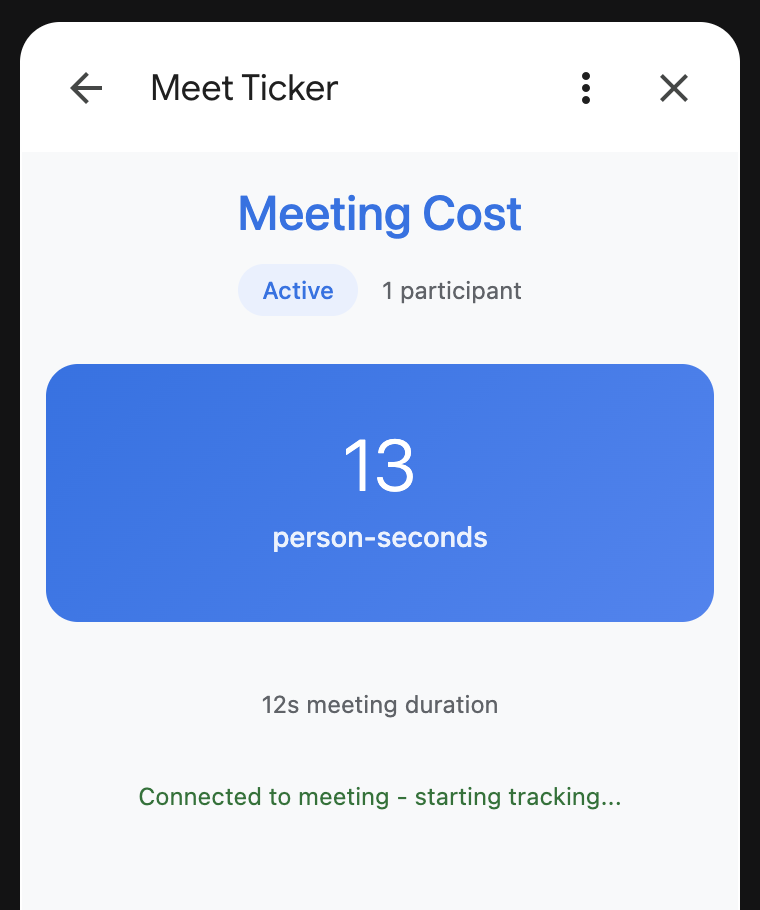

# Meeting Cost Ticker

A Google Meet add-on that tracks real-time person-minutes cost of your meetings. Displays live participant counts and cumulative time investment as meetings progress.

Built with vanilla JavaScript and deployed as a Google Cloud Function.

## Quick Start

1. Copy `.env.template` to `config.env` and add your OAuth credentials
2. Run `./deploy.sh` to deploy to Google Cloud Functions
3. Upload the generated `workspace-deployment-manifest.json` to Google Workspace Marketplace SDK (see instructions below)

Join a Meet, choose "Meeting Tools" (the nine dots) and choose "Meet Ticker" to bring up the clock in a sidebar panel.

Every few seconds the add-on will check how many people are present, and increment the cost accordingly (in theory; I've never actually tried it)

## Required reading

- https://developers.google.com/workspace/meet/add-ons/guides/overview
- https://developers.google.com/workspace/meet/add-ons/guides/quickstart
- https://developers.google.com/workspace/meet/add-ons/guides/deploy-add-on
